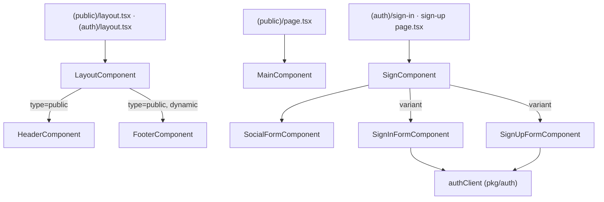

# Client Modules & Widgets

## Purpose

The **Module** and **Widget** layers of the client's Feature-Sliced Design. Modules are page-level composition units (one per page kind: `layout`, `main`, `not-found`, `sign`); widgets are reusable cross-page sections (`header`, `footer`). Both assemble [[client-shared]] components and [[client-pkg]] primitives into renderable UI that the [[client-routing]] tree mounts.

## Key files

Modules (`apps/client/src/app/modules/`):

- `layout/layout.component.tsx` — public/protected chrome switch; renders `HeaderComponent` + `FooterComponent` only when `type === 'public'`. `FooterComponent` is code-split via `next/dynamic`.
- `main/main.component.tsx` — landing/hero section (badge, headline + decorative SVG underline, CTA buttons), embeds `AIToolComponent` and a fixed `FlickeringGridComponent` background. Server component.
- `not-found/not-found.component.tsx` — 404 page: `IconNotFound` illustration, "Page Not Found" copy, "Back to home page" link.
- `sign/sign.component.tsx` — auth card; `variant: 'sign-in' | 'sign-up'` drives title/description and which form renders. Composes `SocialFormComponent` + an "or" separator + (`SignInFormComponent` | `SignUpFormComponent`).
- `sign/elements/` — sub-segment of the sign module (its own `index.ts` barrel):
  - `sign-in-form.component.tsx` — `'use client'` react-hook-form login; calls `authClient.signIn.email`, redirects to `/dashboard` on `res?.token`. Has Remember Me + Forgot Password.
  - `sign-up-form.component.tsx` — `'use client'` registration (email/name/password, 8–20 char password rules); calls `authClient.signUp.email`, redirects to `/dashboard`.
  - `social-form.component.tsx` — `'use client'` Google-icon button; **stub** — `onSubmit` only `console.log`s, no OAuth wiring.
- each module has an `index.ts` barrel re-exporting the default under a `*Component` name.

Widgets (`apps/client/src/app/widgets/`):

- `header/header.component.tsx` — `'use client'` fixed header; `window` scroll listener toggles bg styling via `cn()`, renders `LogoComponent`, Book-a-demo / Sign-in buttons, and a mobile `Drawer` menu.
- `footer/footer.component.tsx` — server-component footer: `LogoComponent`, marketing copy, social icon links (Github/Instagram/Twitter/Youtube), Help/Legal link columns, copyright bar. All links are placeholder `href='#'`.
- `header/index.ts`, `footer/index.ts` — barrels exporting `HeaderComponent` / `FooterComponent`.

## Responsibilities / exports

Every slice follows a strict two-file convention:

```
modules/<slice>/
  <slice>.component.tsx   # default export, comment scaffold: // interface / // component / // render
  index.ts                # export { default as <Slice>Component } from './<slice>.component'
```

- **Barrel exports** (verified): `LayoutComponent`, `MainComponent`, `NotFoundComponent`, `SignComponent`; `HeaderComponent`, `FooterComponent`; and from `sign/elements`: `SignInFormComponent`, `SignUpFormComponent`, `SocialFormComponent`.
- Props are declared inline as `interface IProps` and typed `FC<Readonly<IProps>>`.
- `LayoutComponent` is the **chrome switch** — header + footer only render for `type === 'public'`; the footer is lazy-loaded so protected pages never ship its code.
- The `sign` module nests an `elements/` segment consumed only by the parent via the relative import `./elements` (see `sign.component.tsx:9`).
- **Forms own client state**: `react-hook-form` Controllers + a local `isPending` useState. Auth goes through `authClient` from [[client-pkg]] (`@/pkg/auth/client`); feedback via `toastService`, navigation via the locale-aware `useRouter` from `@/pkg/locale`. Success is gated on `res?.token` (`sign-in-form.component.tsx:34`, `sign-up-form.component.tsx:32`).
- `'use client'` boundaries are confined to the sign form elements and the header; `layout`, `main`, `not-found`, and `footer` are server components.



## Consumed by (route tree — verified)

- `(web)/[locale]/(public)/layout.tsx` & `(auth)/layout.tsx` → `LayoutComponent`
- `(web)/[locale]/(public)/page.tsx` → `MainComponent`
- `(web)/[locale]/(auth)/sign-in/page.tsx` & `sign-up/page.tsx` → `SignComponent`
- `(web)/[locale]/not-found.tsx` → `NotFoundComponent`

(The `(protected)/layout.tsx` consumer cited in pre-gathered notes was not confirmed by grep; treat that one as unverified.)

## Discrepancies & uncertainties

- **Naming inconsistency**: `not-found.component.tsx` names its local component `NotFound` (line 12/36), not `NotFoundComponent` like every other module; the barrel still re-exports it as `NotFoundComponent`.
- **`SocialFormComponent` is non-functional** — `onSubmit` only `console.log(_data)`; the Google icon is loaded from a remote `cdn.shadcnstudio.com` URL. Scaffold/placeholder, not wired social auth.
- **Copy-paste bug**: in `sign-up-form.component.tsx:78` the Name field uses placeholder `'Enter your email address'` (should likely be "Enter your name").
- **Placeholder content**: `FooterComponent` text and all footer/social links are shadcn/studio boilerplate (`href='#'`); `MainComponent` headline ("Sizzling Summer Delights") is template marketing copy. Consistent with this being a scaffold, not product content.
- Whether better-auth's `signIn/signUp.email` actually returns a `token` field in this config (the success gate) was not verified here — see [[auth]] / [[client-pkg]].
