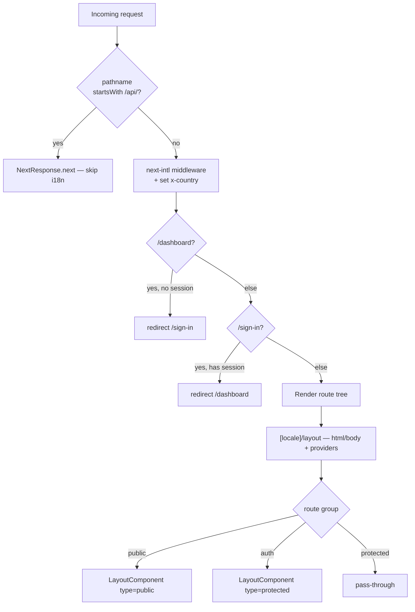

# Client Routing

**Purpose** — Defines the Next.js App Router URL surface for the client web app: a bare pass-through root layout, a `(web)` organizational group, a `[locale]` dynamic segment driven by next-intl (document shell + providers), and `(auth)`/`(protected)`/`(public)` route groups. Edge middleware performs localization, injects geo context, and gates auth-sensitive paths via redirects.

## URL tree

```
app/layout.tsx                         pass-through root (returns children, no <html>)
└─ (web)/                              route group — adds NO URL segment
   └─ [locale]/                        only real path segment; <html>/<body> + providers
      ├─ layout.tsx                    validates locale, setRequestLocale, ThemeProvider/NextIntlClientProvider/RestApiProvider
      ├─ not-found.tsx                 locale-scoped 404 boundary → NotFoundComponent
      ├─ [...not_found]/page.tsx       catch-all → notFound()
      ├─ (auth)/                       layout: <LayoutComponent type='protected'> (no chrome)
      │  ├─ sign-in/page.tsx           <SignComponent variant='sign-in'>
      │  └─ sign-up/page.tsx           <SignComponent variant='sign-up'>
      ├─ (protected)/                  layout: bare pass-through (<>{children}</>)
      │  └─ dashboard/page.tsx         authServer.getSession() → renders user email
      └─ (public)/                     layout: <LayoutComponent type='public'> (Header + Footer)
         └─ page.tsx                   home (/) → <MainComponent>
```

With `localePrefix: 'as-needed'` and a single locale `'en'`, the default locale carries **no URL prefix** — so the public home is `/`, dashboard is `/dashboard`, etc.

## Key files

- `apps/client/src/proxy.ts` — Edge middleware: short-circuits `/api/*`, runs next-intl localization, injects `x-country` header+cookie, and gates `/dashboard` (require session, else redirect `/sign-in`) and `/sign-in` (redirect to `/dashboard` if already authed). `config.matcher` excludes `_next`, `_vercel`, static assets, and a long list of file extensions.
- `apps/client/src/pkg/locale/routing.ts` — `defineRouting`: `locales: ['en']`, `localePrefix: 'as-needed'`, `localeDetection: false`, `defaultLocale: 'en'`.
- `apps/client/src/pkg/locale/navigation.ts` — `createNavigation(routing)` → locale-aware `Link`, `redirect`, `usePathname`, `useRouter`, `getPathname`.
- `apps/client/src/pkg/locale/request.ts` — `getRequestConfig`: resolves locale via `hasLocale(...)` (else `defaultLocale`), loads `../../../translations/${locale}.json`, exports a shared `formats` (`dateTime`/`number`/`list`).
- `apps/client/src/pkg/locale/index.ts` — barrel re-exporting routing, navigation helpers, and `getRequestConfig`.
- `apps/client/src/app/layout.tsx` — root layout: a pass-through that just `return children` (no `<html>`). Document shell lives in the `[locale]` layout.
- `apps/client/src/app/(web)/[locale]/layout.tsx` — renders `<html lang>`/`<body>` (fonts from `@/config/fonts`), validates locale via `hasLocale` (else `notFound()`), calls `setRequestLocale`, wraps children in `ThemeProvider` → `NextIntlClientProvider` → `RestApiProvider`, mounts `Toaster`. Exports `generateStaticParams` (from `routing.locales`) and `generateMetadata` (title template, OpenGraph, favicon/OG image from `EAssetImage`, `metadataBase` from `NEXT_PUBLIC_CLIENT_WEB_URL`).
- `apps/client/src/app/(web)/[locale]/(auth)/layout.tsx` — `<LayoutComponent type='protected'>` (no header/footer chrome).
- `apps/client/src/app/(web)/[locale]/(auth)/sign-in/page.tsx` / `sign-up/page.tsx` — `<SignComponent variant=...>`, metadata titles `Sign In` / `Sign Up`.
- `apps/client/src/app/(web)/[locale]/(protected)/layout.tsx` — **bare pass-through** (`return <>{children}</>`); no chrome, no auth check.
- `apps/client/src/app/(web)/[locale]/(protected)/dashboard/page.tsx` — calls `authServer.getSession()` and renders `data.user?.email`; metadata title `Dashboard`.
- `apps/client/src/app/(web)/[locale]/(public)/layout.tsx` — `<LayoutComponent type='public'>` (Header + lazy Footer).
- `apps/client/src/app/(web)/[locale]/(public)/page.tsx` — home (`/`) → `<MainComponent>`.
- `apps/client/src/app/(web)/[locale]/[...not_found]/page.tsx` — catch-all that calls `notFound()`.
- `apps/client/src/app/(web)/[locale]/not-found.tsx` — locale-scoped 404 boundary → `NotFoundComponent`.
- `apps/client/src/app/modules/layout/layout.component.tsx` — shared chrome; renders `HeaderComponent` and a `dynamic()`-imported `FooterComponent` **only when `type === 'public'`**; `type` is `'public' | 'protected'`.
- `apps/client/src/app/global-error.tsx` — `'use client'` root error boundary; renders its own `<html>`/`<body>` with a "Go to Home" button.
- `apps/client/src/app/robots.ts` — `MetadataRoute.Robots` disallowing all crawlers (`userAgent: '*'`, `disallow: '*'`).
- `apps/client/next.config.ts` — wires next-intl via `createNextIntlPlugin` (`requestConfig: ./src/pkg/locale/request.ts`, generates `./translations/en.json` declaration); also svgr (turbopack + webpack), image `remotePatterns`, and `_next/image` cache headers.

## How it works in this repo

**Two-stage locale validation.** The locale param is checked first in `proxy.ts` (next-intl middleware) and again in `[locale]/layout.tsx` via `hasLocale(routing.locales, locale)` → `notFound()` on mismatch. Both reuse the single `routing` config from `pkg/locale`.

**Chrome differs by route group.**

| Route group | Layout renders | Header/Footer |
|---|---|---|
| `(public)` | `LayoutComponent type='public'` | yes |
| `(auth)` | `LayoutComponent type='protected'` | no |
| `(protected)` | bare `<>{children}</>` | none |

Note: only `(auth)` actually calls `LayoutComponent`; `(protected)` is a literal pass-through — the two are NOT identical.

**Auth gating lives at the edge, not in the layout.** In `proxy.ts`:

```ts
if (req.nextUrl.pathname.startsWith('/dashboard')) {
  const session = await authServer.getSession()
  if (!session) return NextResponse.redirect(new URL('/sign-in', req.url))
}
if (req.nextUrl.pathname.startsWith('/sign-in')) {
  const session = await authServer.getSession()
  if (session) return NextResponse.redirect(new URL('/dashboard', req.url))
}
```

`authServer.getSession()` fetches `NEXT_PUBLIC_CLIENT_API_URL/api/v1/auth/get-session` forwarding the incoming `headers()`, returning `{ user, session }` (or `{ user: null, session: null }` on error). See [[auth]] for the session contract.

**Geo context injection.** Middleware derives a country from `cf-ipcountry` → `cloudfront-viewer-country` → `X-Country` → the `country` cookie → `'N/A'`, then sets both an `x-country` response header and an `x-country` cookie on the next-intl response.

**Localized 404 chain.** Any unmatched path under `[locale]` resolves to `[...not_found]/page.tsx`, which calls `notFound()`; that is caught by the locale-scoped `not-found.tsx` boundary rendering `NotFoundComponent`.

**Static rendering.** Every leaf page (`home`, `sign-in`, `sign-up`, `dashboard`) awaits `params` and calls `setRequestLocale(locale)`. The `[locale]` layout's `generateStaticParams` enumerates `routing.locales`.

**Messages.** `request.ts` imports `../../../translations/${locale}.json`, which resolves to `apps/client/translations/en.json` (a sibling of `src/`; currently near-empty at ~36 bytes).

## Request flow



## Uncertainties / discrepancies

- **`(protected)/layout.tsx` does NOT apply protected chrome and performs no server-side auth check** — it is a literal `<>{children}</>` pass-through. Protection relies entirely on the middleware path-prefix check for `/dashboard`. A future protected route added under `(protected)` with a different path prefix would be unguarded unless `proxy.ts` is updated.
- **Auth checks match raw pathnames `/dashboard` and `/sign-in`.** Because `localePrefix` is `'as-needed'` with only `'en'`, these unprefixed prefixes work today; adding a prefixed locale could make `startsWith('/dashboard')` miss `/<locale>/dashboard`.
- **`if (!session)` checks the whole `getSession()` object, not a session field.** `getSession()` returns `{ user, session }`; a non-null object (even `{ user: null, session: null }` on the catch path) is truthy, so the redirect hinges on the endpoint/fetch behavior. (unverified end-to-end)
- `dashboard/page.tsx` does no server-side redirect of its own if the session is missing — it reads `data.user?.email` (safe when null) and trusts middleware for access control.
- Root layout metadata title is the literal `'Website'` (template `"%s | Website"`); intended to be customized per project.
